# 第16回 理科（気体（1））知識図譜

## 1. 知識図譜（全体構造図）

```mermaid
graph TD
    Gas[気体（1）] --> Collection[1. 気体の集め方]
    Gas --> MainGases[2. 代表的な気体の性質と製法]
    Gas --> AirComposition[3. 空気の成分]
    Gas --> Safety[4. ガスボンベの色・環境問題]

    %% 気体の集め方
    Collection --> WaterDisp[水上置換法: 水に溶けにくい気体, 純粋に集まる]
    Collection --> Downward[下方置換法: 水に溶けやすく, 空気より重い気体]
    Collection --> Upward[上方置換法: 水に溶けやすく, 空気より軽い気体]

    %% 代表的な気体
    MainGases --> O2[酸素 O2]
    O2 --> O2_Prop[無色・無臭 / 空気より少し重い / 水に溶けにくい / 助燃性（燃えるのを助ける）]
    O2 --> O2_Make[製法: 過過酸化水素水 + 二酸化マンガン（触媒）]
    O2 --> O2_Collect[水上置換法]

    MainGases --> CO2[二酸化炭素 CO2]
    CO2 --> CO2_Prop[無色・無臭 / 空気より重い / 水に少し溶けて炭酸水（弱酸性） / 石灰水を白く濁らせる（炭酸カルシウム） / 水酸化ナトリウム水溶液によく吸収される]
    CO2 --> CO2_Make1[製法1: 炭酸カルシウム（石灰石） + 塩酸]
    CO2 --> CO2_Make2[製法2: 炭酸水素ナトリウム（重ソウ）を加熱]
    CO2 --> CO2_Collect[水上置換法 または 下方置換法]

    MainGases --> H2[水素 H2]
    H2 --> H2_Prop[無色・無臭 / 最も軽い気体 / 水にほとんど溶けない / 可燃性（燃えて水ができる, ポッと音）]
    H2 --> H2_Make[製法: 金属（アルミニウム・亜鉛・鉄） + 塩酸]
    H2 --> H2_Collect[水上置換法]

    MainGases --> NH3[アンモニア NH3]
    NH3 --> NH3_Prop[無色・強い刺激臭 / 空気より軽い / 水に極めてよく溶ける / アルカリ性（フェノールフタレインを赤くする, 噴水実験）]
    NH3 --> NH3_Make1[製法1: アンモニア水を加熱（突沸防止に沸とう石）]
    NH3 --> NH3_Make2[製法2: 塩化アンモニウム + 水酸化カルシウム（消石灰）を加熱]
    NH3 --> NH3_Collect[上方置換法]

    MainGases --> HCl[塩化水素 HCl]
    HCl --> HCl_Prop[無色・強い刺激臭 / 空気より重い / 水に極めてよく溶ける / 水溶液は塩酸（酸性）]
    HCl --> HCl_Make[製法: 濃い塩酸を加熱]
    HCl --> HCl_Collect[下方置換法]

    MainGases --> SO2[二酸化硫黄 SO2]
    SO2 --> SO2_Prop[無色・強い刺激臭 / 有毒 / 空気より重い / 水に溶けて亜硫酸（酸性） / 漂白作用（花の色を抜く）]
    SO2 --> SO2_Make[製法: 硫黄を燃やす（青白い炎）]
    SO2 --> SO2_Collect[下方置換法]

    %% 空気の成分
    AirComposition --> N2[ちっ素 N2: 78.08%]
    N2 --> N2_Prop[空気より少し軽い / タンパク質や肥料の原料 / 高温で酸素と結びつき窒素酸化物（NOx）になり酸性雨の原因]
    AirComposition --> O2_Comp[酸素 O2: 20.95%]
    AirComposition --> Ar[アルゴン Ar: 0.93%（電球に使用）]
    AirComposition --> CO2_Comp[二酸化炭素 CO2: 0.04%（温室効果ガス）]
    AirComposition --> CH4[メタン CH4: 天然ガスや都市ガスの主成分, 温室効果ガス]
    AirComposition --> CO[一酸化炭素 CO: 不完全燃焼で発生, 有毒（酸素運搬を阻害）]

    %% その他
    Safety --> Cylinder[ガスボンベの色]
    Cylinder --> Cyl_O2[酸素: 黒色]
    Cylinder --> Cyl_CO2[二酸化炭素（液化炭酸）: 緑色]
    Cylinder --> Cyl_NH3[液化アンモニア: 白色]
    Cylinder --> Cyl_H2[水素: 赤色]
    Safety --> Environment[環境問題]
    Environment --> AcidRain[酸性雨: 窒素酸化物や二酸化硫黄が原因]
    Environment --> Smog[光化学スモッグ: 窒素酸化物 + 揮発性有機化合物（VOC）が紫外線で光化学オキシダントになり発生]
```

## 2. 各分野の詳細解説

### 一、 気体の集め方 (How to collect Gases)
気体の性質（「水に溶けやすいか」「空気より重いか軽いか」）によって、集め方を使い分けます。

1. **水上置換法（すいじょうちかんほう）**
   * **対象**：水に溶けにくい気体。
   * **特徴**：他の気体（空気など）が混ざりにくく、最も純粋な気体を集めることができます。
   * **注意点**：酸素などを発生させる際、装置のフラスコ内に最初からあった空気を追い出すため、**集気びん1本分くらいは捨ててから**集め始めます。
2. **下方置換法（かほうちかんほう）**
   * **対象**：水に溶けやすく、空気より重い気体。
   * **特徴**：集気びんの口を上に向けて、ガラス管を底まで入れて空気を押し出すように集めます。
3. **上方置換法（じょうほうちかんほう）**
   * **対象**：水に溶けやすく、空気より軽い気体。
   * **特徴**：集気びんの口を下に向けて、上昇してくる気体を集めます。

---

### 二、 代表的な気体の性質と製法 (Key Gases)

| 気体名 | 化学式 | 空気と比べた重さ | 水への溶け方 | 特有のにおい | 燃焼性・その他 | 発生方法（化学反応式） | 集め方 |
| :--- | :--- | :--- | :--- | :--- | :--- | :--- | :--- |
| **酸素** | $\text{O}_2$ | 少し重い (約1.1倍) | 溶けにくい | なし | 助燃性（燃えるのを助ける） | $\text{過酸化水素} \xrightarrow{\text{二酸化マンガン（触媒）}} \text{酸素} + \text{水}$ | 水上置換法 |
| **二酸化炭素** | $\text{CO}_2$ | 重い (約1.5倍) | 少し溶ける | なし | 不燃性 / 石灰水を白く濁らせる / 水酸化ナトリウムによく吸収される | $\text{炭酸カルシウム（石灰石）} + \text{塩酸} \rightarrow \text{二酸化炭素} + \text{水} + \text{塩化カルシウム}$ または $\text{炭酸水素ナトリウム（重ソウ）} \xrightarrow{\text{加熱}} \text{二酸化炭素} + \text{水} + \text{炭酸ナトリウム}$ | 水上置換法 / 下方置換法 |
| **水素** | $\text{H}_2$ | 極めて軽い (約0.07倍) | ほとんど溶けない | なし | 可燃性（燃えて水ができる。空気を混ぜて火をつけると爆発的に燃える） | $\text{金属（アルミニウムなど）} + \text{塩酸} \rightarrow \text{水素} + \text{塩化アルミニウム}$ | 水上置換法 |
| **アンモニア** | $\text{NH}_3$ | 軽い (約0.6倍) | 極めてよく溶ける | 強い刺激臭 | 不燃性 / 水溶液はアルカリ性（フェノールフタレイン液で赤色に変化・噴水実験） | $\text{塩化アンモニウム} + \text{水酸化カルシウム} \xrightarrow{\text{加熱}} \text{アンモニア} + \text{水} + \text{塩化カルシウム}$ | 上方置換法 |
| **塩化水素** | $\text{HCl}$ | 重い (約1.3倍) | 極めてよく溶ける | 強い刺激臭 | 不燃性 / 水溶液は塩酸（酸性） | $\text{濃い塩酸} \xrightarrow{\text{加熱}} \text{塩化水素}$ | 下方置換法 |
| **二酸化硫黄** | $\text{SO}_2$ | 重い (約2.3倍) | よく溶ける | 強い刺激臭 | 不燃性 / 有毒 / 水溶液は亜硫酸（酸性） / 漂白作用（花の色が薄くなる） | $\text{硫黄} \xrightarrow{\text{燃焼}} \text{二酸化硫黄}$ | 下方置換法 |

---

### 三、 空気の成分 (Air Composition)
かわいた空気にふくまれる気体の体積割合：

1. **ちっ素 ($\text{N}_2$)**：**約78%**（空気中で最も多い）。
   * 水に溶けにくく、無色無臭。
   * 体をつくるタンパク質や植物の肥料の原料。
   * 排出ガス中の**窒素酸化物 ($\text{NO}_x$)**は酸性雨の原因。
2. **酸素 ($\text{O}_2$)**：**約21%**（2番目に多い）。
3. **アルゴン ($\text{Ar}$)**：**約0.93%**（3番目に多い）。電球の中に詰められています。
4. **二酸化炭素 ($\text{CO}_2$)**：**約0.04%**。温室効果ガスの一つ。
5. **メタン ($\text{CH}_4$)**：天然ガスの主成分。強力な温室効果ガス。
6. **一酸化炭素 ($\text{CO}$)**：炭素が不完全燃焼したときに発生。有毒で、血液の酸素運搬を妨げます（一酸化炭素中毒）。青い炎を出して燃え、二酸化炭素になります。

---

### 四、 実験上の重要なポイント・注意点 (Important Lab Notes)

1. **二酸化マンガンと触媒（しょくばい）**
   * 酸素をつくるときに使う**二酸化マンガン**は、それ自身は変化せず、過酸化水素水が酸素と水に分解するのを助けるはたらきをします。このように、反応の前後で自身が変化しない物質を**触媒**といいます。
2. **試験管加熱時の注意（炭酸水素ナトリウムの分解など）**
   * 炭酸水素ナトリウムを加熱するとき、発生した水が熱い試験管の底に流れていって急冷され、試験管が割れるのを防ぐため、**試験管の口の方を少し下げて**加熱します。
   * 加熱を終えるときは、水そうの水が逆流するのを防ぐため、**必ず先にガラス管を水から抜いてから、ガスバーナーの火を消します**。
3. **アンモニアの噴水実験のしくみ**
   * スポイトで丸底フラスコ内に少量の水を入れると、アンモニアが水に極めてよく溶けるためフラスコ内の気圧が急激に下がります。これによりビーカー内の水（フェノールフタレイン液入り）が吸い上げられ、フラスコ内でアルカリ性を示す赤色の噴水となります。
4. **ガスボンベの色分け**
   * 誤使用を防ぐため、高圧ガスボンベは色分けされています。
     * **酸素**：黒色
     * **二酸化炭素（液化炭酸）**：緑色
     * **水素**：赤色
     * **液化アンモニア**：白色
